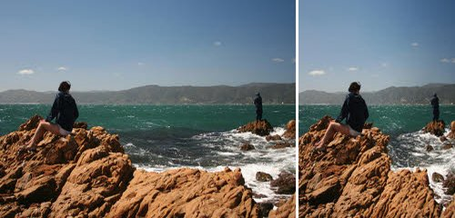

# Seam-Carving

This repository implements the seam-carving algorithm proposed in [1] for resizing an image. The crux of the technique is a dynamic programming algorithm that iteratively removes seams(connected pixels across the width or across the height) with the lowest energy, and reduces the size of the image by 1 pixel at every iteration.

## References

1. Avidan, S. and Ariel Shamir. “Seam carving for content-aware image resizing.” SIGGRAPH 2007 (2007).
